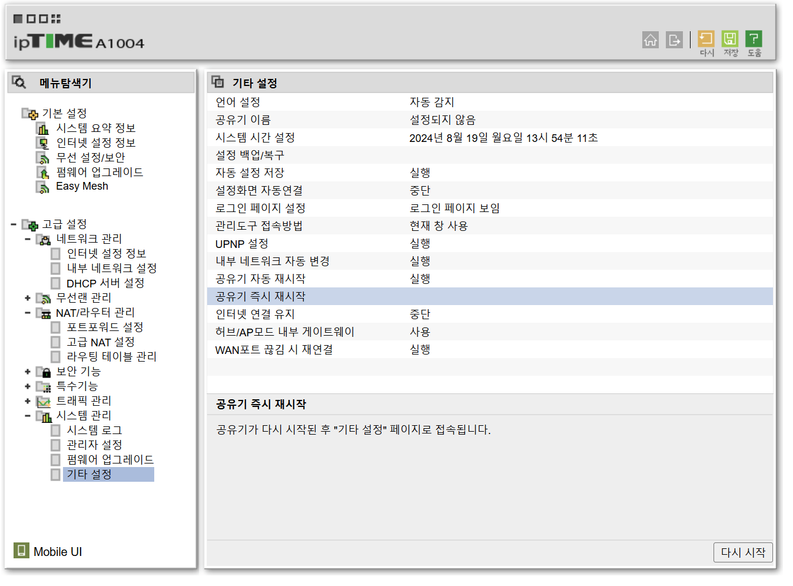
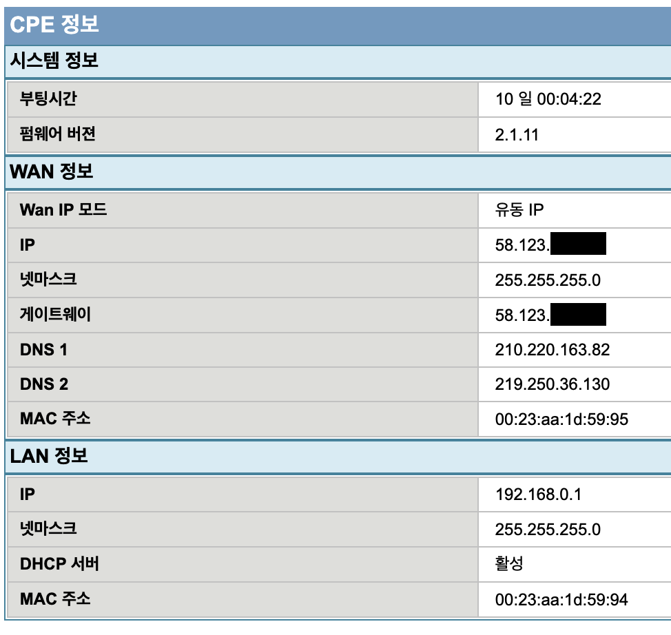
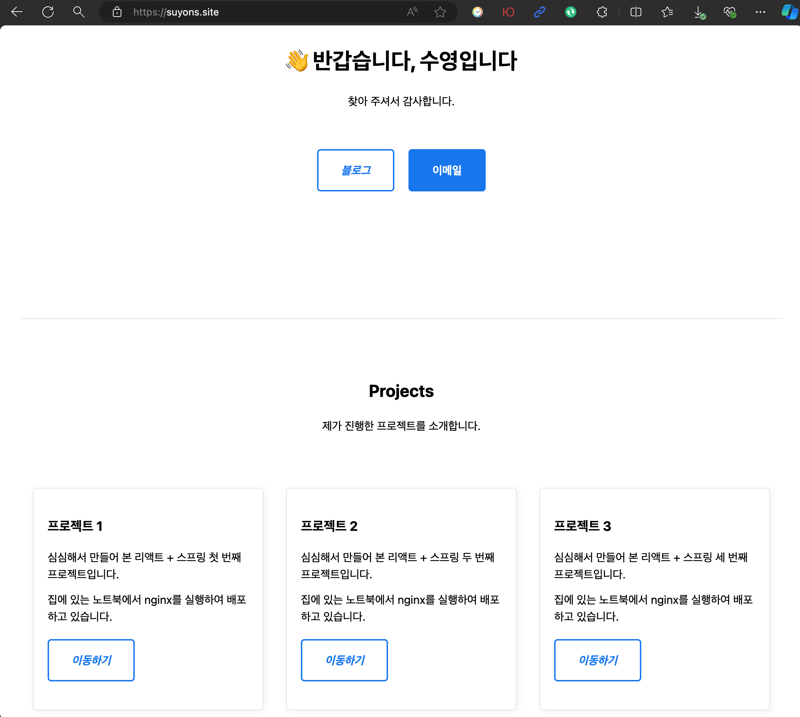
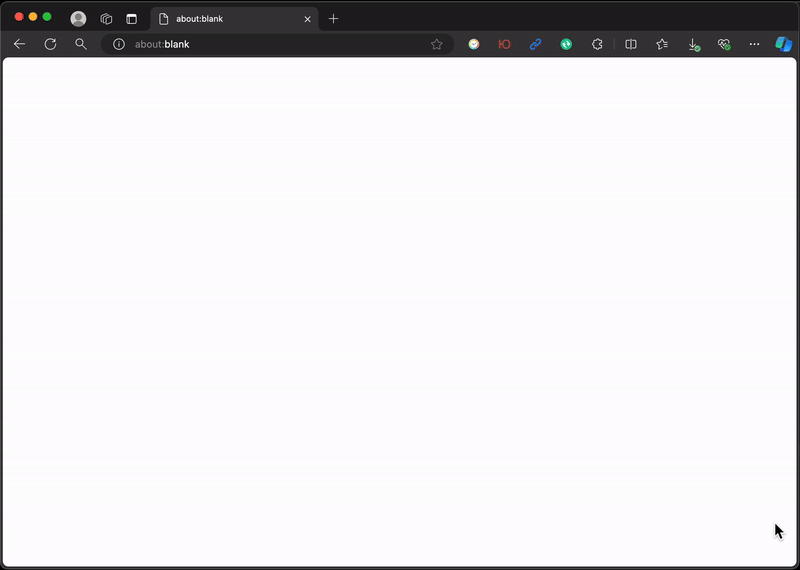

# 주의사항

1. 집에서 PC로 사이드 프로젝트를 배포하려면 저전력 PC로 해야 됩니다.
2. 게임할 때 쓰는, 그래픽 카드 달린 고전력 PC를 쓴다면 전기먹는 하마를 키우는 겁니다. IDLE 전력만으로 매월 치킨 1마리는 한전에 뜯깁니다.
3. TDP 15W 이하 CPU 추천합니다. 중저가 노트북 매우 추천합니다.
4. 본인 PC 정보: Firebat S1 미니 PC / CPU: Intel N100 (TDP 9W)
   https://ko.aliexpress.com/item/1005006408519409.html
5. 시스템 전체 평균 15W로 24시간 내내 한 달 돌린다 하면 전력량 10.8kWh로, 2천원 수준입니다.
   https://online.kepco.co.kr/PRM033D00
6. VS Code, JDK, node.js는 설치되어 있죠?

# nginx

## 설치 및 실행하기

1. 다운로드 링크
   https://nginx.org/en/download.html

2. Stable 버전으로 설치했습니다


3. 압축 풀기는 CMD 켜면 나오는 초기 경로에 해 주세요
   보통 `C:\Users\계정이름` 형식입니다.


4. nginx를 시작하기 전에 혹시 TCP 80 포트를 사용하고 있는 프로세스가 있는지 검사합니다.

```
C:\Users\young>netstat -ano | findstr :80
  TCP    0.0.0.0:80             0.0.0.0:0              LISTENING       12976

C:\Users\young>taskkill /pid 12976 /f /t
성공: PID 13800인 프로세스(PID 12976인 자식 프로세스)가 종료되었습니다.
성공: PID 12976인 프로세스(PID 11572인 자식 프로세스)가 종료되었습니다.
```

5. 2가지 테스트가 통과되어야 실행 가능합니다.

```
C:\Users\young>cd nginx-1.26.2

C:\Users\young\nginx-1.26.2>nginx -t
nginx: the configuration file C:\Users\young\nginx-1.26.2/conf/nginx.conf syntax is ok
nginx: configuration file C:\Users\young\nginx-1.26.2/conf/nginx.conf test is successful

C:\Users\young\nginx-1.26.2>nginx
```

6. `http://localhost` 접속 시 이렇게 표시되면 성공입니다.


## 설정하기

1. `nginx.conf` 파일을 수정해 줍니다.


기존 내용은 모두 지우고 아래의 내용으로 덮어 써 주세요.

> nginx.conf

```
worker_processes 1;

error_log logs/error.log;
pid logs/nginx.pid;

events {
  worker_connections 1024;
}

http {
  server {
    listen 80;
    charset utf-8;

    location / {
      root html;
      index index.html;
    }

    location /frontend {
      proxy_pass http://localhost:10001/;
    }

    location /backend {
      proxy_pass http://localhost:20001/;
    }
  }
}
```

2. nginx를 리로드합니다.

```
C:\Users\young\nginx-1.26.2>nginx -s reload
```

# React

## 프로젝트 생성하기

1. `D:\react-spring` 폴더 아래 리액트 프로젝트를 생성하겠습니다.

```
D:\react-spring>npx create-react-app frontend
Need to install the following packages:
create-react-app@5.0.1
Ok to proceed? (y) y
```

2. `npm start`로 프로젝트를 실행합니다.

```
D:\react-spring\frotend>npm start

Compiled successfully!

You can now view frontend in the browser.

  Local:            http://localhost:3000
  On Your Network:  http://192.168.0.11:3000

Note that the development build is not optimized.
To create a production build, use npm run build.

webpack compiled successfully
```


## 예시 코드

1. `Ctrl` + `C`를 눌러 실행 중인 보일러플레이트를 종료하고, 사진과 같이 최소의 파일만 남깁니다.
   `build` 폴더와 `.env`는 지금 당장 없는 게 맞습니다.


> index.html

```html
<!DOCTYPE html>
<html lang="ko">
  <head>
    <meta
      charset="UTF-8"
      name="viewport"
      content="width=device-width, initial-scale=1.0"
    />
    <title>헬로 리액트</title>
  </head>

  <body>
    <div id="root"></div>
  </body>
</html>
```

> App.css

```css
.app {
  text-align: center;
  padding: 20px;
}

.title {
  margin-bottom: 20px;
}

form {
  display: flex;
  flex-direction: column;
  align-items: center;
}

.input-group {
  display: flex;
  flex-direction: column;
  margin-bottom: 10px;
}

.input-group label {
  margin-bottom: 5px;
}

.input-group input {
  padding: 10px;
  border: 1px solid #ccc;
  border-radius: 5px;
  width: 200px; /* input 폭 2배 */
}

button {
  margin-top: 10px;
  padding: 10px 20px;
  background-color: #4caf50;
  color: white;
  border: none;
  border-radius: 5px;
  cursor: pointer;
}
```

> App.js

```js
import { useState } from "react";
import "./App.css";

function App() {
  const [inputText, setInputText] = useState("");
  const [outputText, setOutputText] = useState("");

  const handleSubmit = (e) => {
    e.preventDefault();
    fetch("/backend", {
      method: "POST",
      headers: {
        "Content-Type": "application/json",
      },
      body: JSON.stringify({ inputText: inputText }),
    })
      .then((response) => response.json())
      .then((data) => setOutputText(data.outputText))
      .catch((error) => {
        console.error(error);
      });
  };
  return (
    <div className="app">
      <h2 className="title">내용을 입력해 주세요</h2>
      <form onSubmit={handleSubmit}>
        <div className="input-group">
          <label htmlFor="inputText">요청</label>
          <input
            name="inputText"
            id="inputText"
            type="text"
            value={inputText}
            onChange={(e) => setInputText(e.target.value)}
          />
        </div>
        <div className="input-group">
          <label htmlFor="outputText">응답</label>
          <input
            name="outputText"
            id="outputText"
            type="text"
            value={outputText}
            readOnly
          />
        </div>
        <button type="submit">전송</button>
      </form>
    </div>
  );
}

export default App;
```

> index.js

```js
import React from "react";
import ReactDOM from "react-dom/client";
import App from "./App";

const root = ReactDOM.createRoot(document.getElementById("root"));
root.render(<App />);
```

2. `.env` 파일을 최상위에 추가하여 포트 번호와 기본 URL을 변경합니다.

> .env

```
PORT=10001
PUBLIC_URL=/frontend
```

3. 다시 `npm start` 실행하여 화면이 정상적으로 표시되는지 확인합니다.


## 빌드 및 배포하기

1. 코드 수정 이후 정상 동작이 확인되어 빌드 후 배포를 해 보겠습니다.

```
D:\react-spring\frontend>npm run build

> frontend@0.1.0 build
> react-scripts build

Creating an optimized production build...

(생략)

Compiled successfully.
```

```
D:\react-spring\frontend>npm install -g serve

added 90 packages in 6s

24 packages are looking for funding
  run `npm fund` for details
```

```
D:\react-spring\frontend>serve -s build -l 10001

      Serving!

      - Local:    http://localhost:10001
      - Network:  http://192.168.0.11:10001

      Copied local address to clipboard!


```

2. 아래와 같이 접속하여 정상적으로 열리는지 확인합니다.


# Spring

## 프로젝트 생성하기

1. VS Code에서 Spring 프로젝트를 생성해 보겠습니다.
   다음 확장 프로그램을 설치해 주세요.


2. Maven 프로젝트를 만들어 보겠습니다.


3. 계속 엔터 엔터 누르면서 넘어가다가 Artifact Id 입력하는 곳에서 멈추고 기본값인 `demo`를 `backend`로 바꾸겠습니다. Artifact Id는 프로젝트 이름입니다.


4. 이후 JAR/WAR 선택, Java 버전 선택도 엔터 엔터로 넘기고 의존성 선택하는 과정은 사진과 같이 2가지만 담겠습니다.


5. 마지막으로 폴더 선택 화면에서도 그대로 엔터 눌러 주세요.


6. 하단 우측 알림에서 `Open` 버튼을 눌러 새 창에서 프로젝트를 엽니다.


## 예시 코드

1. 프로젝트 파일 구성은 다음과 같이 되어 있습니다.


2. 수정해야 할 파일은 2개 뿐입니다.

> TextController.java

```java
package com.example.backend.controller;

import java.util.HashMap;

import org.springframework.http.ResponseEntity;
import org.springframework.web.bind.annotation.PostMapping;
import org.springframework.web.bind.annotation.RequestBody;
import org.springframework.web.bind.annotation.RestController;

@RestController
public class TextController {
    @PostMapping(value = "/", consumes = "application/json", produces = "application/json")
    public ResponseEntity<HashMap<String, String>> postText(@RequestBody HashMap<String, String> textMap) {
        System.out.println("리액트가 보냄: " + textMap.get("inputText"));
        textMap.remove("inputText");
        textMap.put("outputText", "스프링이 보냄: POST 받았음");
        return ResponseEntity.ok().body(textMap);
    }
}
```

> application.properties

```
spring.application.name=backend
server.port=20001
```

3. 현재 프로젝트가 정상 동작하는지 확인해 보겠습니다.

```
D:\react-spring\backend>mvnw spring-boot:run
[INFO] Scanning for projects...

(생략)

2024-08-19T12:51:05.765+09:00  INFO 7348 --- [backend] [  restartedMain] com.example.backend.BackendApplication   : Started BackendApplication in 1.922 seconds (process running for 2.372)
```

4. Postman 또는 Thunder client 확장 프로그램을 이용하여 API를 테스트할 수 있습니다.


5. Spring 프로젝트를 구동하는 콘솔 화면에는 다음과 같이 출력됩니다.

```
리액트가 보냄: 포스트 잘 되니?
```

## 빌드 및 배포하기

1. Spring 프로젝트가 실행 중인 콘솔 화면에서 `Ctrl + C`를 눌러 종료합니다.

```
일괄 작업을 끝내시겠습니까 (Y/N)? y
```

2. mvnw (Maven Wrapper)를 이용하여 프로젝트를 JAR 패키지로 빌드합니다

```
D:\react-spring\backend>mvnw clean package

[INFO] Scanning for projects...

(생략)

[INFO] ------------------------------------------------------------------------
[INFO] BUILD SUCCESS
[INFO] ------------------------------------------------------------------------
[INFO] Total time:  16.937 s
[INFO] Finished at: 2024-08-19T12:56:10+09:00
[INFO] ------------------------------------------------------------------------
```

3. 빌드된 JAR 패키지를 실행합니다.

```
D:\react-spring\backend>cd target

D:\react-spring\backend\target>java -jar backend-0.0.1-SNAPSHOT.jar

  .   ____          _            __ _ _
 /\\ / ___'_ __ _ _(_)_ __  __ _ \ \ \ \
( ( )\___ | '_ | '_| | '_ \/ _` | \ \ \ \
 \\/  ___)| |_)| | | | | || (_| |  ) ) ) )
  '  |____| .__|_| |_|_| |_\__, | / / / /
 =========|_|==============|___/=/_/_/_/

 :: Spring Boot ::                (v3.3.2)


(생략)

2024-08-19T12:58:46.696+09:00  INFO 13104 --- [backend] [           main] com.example.backend.BackendApplication   : Started BackendApplication in 3.362 seconds (process running for 4.1)
```

## 리액트와 같이 실행하기

1. 콘솔 창을 새로 열어 빌드된 리액트 프로젝트도 같이 실행합니다.

```
D:\react-spring\frontend>serve -s build -l 10001

Serving!

- Local:    http://localhost:10001
- Network:  http://192.168.0.11:10001

Copied local address to clipboard!
```

2. 요청, 응답, 콘솔에 정상적으로 표시됨을 확인했습니다.


# 네트워크 설정

## 방화벽 설정하기

1. 나 혼자 localhost에서 보는 것으로 끝내는 게 아니라, 다른 PC에서도 나의 프로젝트를 볼 수 있어야죠? 외부에서 내 페이지에 접근할 수 있도록 설정해 보겠습니다.

2. 먼저 프로젝트가 실행 중인 PC의 IP 주소를 확인하겠습니다.

```
C:\Users\young>ipconfig

Windows IP 구성

이더넷 어댑터 이더넷:

   연결별 DNS 접미사. . . . :
   링크-로컬 IPv6 주소 . . . . : fe80::bc58:e41d:31c2:31d8%10
   IPv4 주소 . . . . . . . . . : 192.168.0.11
   서브넷 마스크 . . . . . . . : 255.255.255.0
   기본 게이트웨이 . . . . . . : 192.168.0.1
```

3. IP 주소를 확인했으니 알아낸 IP 주소로, 다른 기기에서 접속을 시도해 보겠습니다.
   동일한 공유기에 Wi-Fi 또는 이더넷을 통해 연결하여 동일 네트워크에 있어야 합니다.


4. TCP 80 포트가 개방되어 있지 않다 보니 접속이 안 됩니다.

5. 방화벽 설정을 열어 줍니다.


6. **인바운드 규칙**에 HTTP, HTTPS 연결을 허용하는 규칙을 추가하겠습니다.


7. 외부 기기에서 새로고침하면 페이지가 표시됩니다.


## 서버의 IP 주소 고정하기

1. 이전의 `ipconfig` 명령어 입력의 결과물에서 `기본 게이트웨이` 항목이 있었습니다.

```
C:\Users\young>ipconfig

Windows IP 구성

이더넷 어댑터 이더넷:

   연결별 DNS 접미사. . . . :
   링크-로컬 IPv6 주소 . . . . : fe80::bc58:e41d:31c2:31d8%10
   IPv4 주소 . . . . . . . . . : 192.168.0.11
   서브넷 마스크 . . . . . . . : 255.255.255.0
   기본 게이트웨이 . . . . . . : 192.168.0.1
```

2. 브라우저에서 기본 게이트웨이 주소를 입력해 보겠습니다. 이건 서버에서 해도 되고, 클라이언트에서 해도 됩니다. 동일 네트워크에 연결되어 있다면 무관합니다. 저는 서버에서 접속하기를 추천드립니다.

3. 저는 SK브로드밴드의 모뎀을 공유기로 쓰고 있어서 관리자 페이지가 이렇게 나오고 있습니다.
   이 장비 기준으로 설명하고 나서 추가로 iptime 공유기 기준으로도 설명해 드리겠습니다.


4. 네트워크 - LAN - 고정 IP 할당


5. 여기에 서버의 MAC 주소와, 고정으로 사용할 IP 주소를 입력했습니다.


6. MAC 주소는 `ipconfig -all` 명령어로 확인 가능합니다.

```
C:\Users\young>ipconfig -all

이더넷 어댑터 이더넷:

   연결별 DNS 접미사. . . . :
   설명. . . . . . . . . . . . : Realtek PCIe GbE Family Controller
   물리적 주소 . . . . . . . . : 68-1D-EF-FF-FF-FF
   DHCP 사용 . . . . . . . . . : 예
   자동 구성 사용. . . . . . . : 예
   IPv4 주소 . . . . . . . . . : 192.168.0.11(기본 설정)
   서브넷 마스크 . . . . . . . : 255.255.255.0

(생략)
```

7. iptime 공유기에서는 다음 메뉴에서 설정 가능합니다.


## 포트 포워딩

1. NAT - 포트 포워딩 메뉴에서 고정한 IP 주소에 대해 TCP 80, 443 포트를 개방하는 규칙을 추가했습니다.


2. iptime 공유기에서는 다음 메뉴에서 설정 가능합니다.


3. 고정 IP 주소, 포트 포워드 설정을 완료했다면 공유기의 전원을 껐다가 켜 줍니다.



## 외부 접속 확인하기

1. 공유기에 할당된 공인 IP 주소를 확인합니다.



2. 스마트폰의 Wi-Fi를 끄고 LTE로 서버에 접속해 보겠습니다.
   예를 들어 방금 알아낸 IP 주소가 `58.123.45.67`이라면 입력해야 할 URL은 다음과 같습니다.
   **같은 네트워크에 있는 기기에서 공인 IP 주소를 입력하면 접속이 안 됩니다.**

> http://58.123.45.67/frontend


# 도메인 연결

## 가비아 도메인 구매하기

1. 방금 모바일로 접속한 URL을 그대로 공유해도 되겠지만 멋있지는 않죠? 도메인을 연결해 더 멋지게 만들어 보겠습니다.

2. 가비아에서 제 ID인 suyons를 입력하여 저렴한 도메인을 하나 구매했습니다.

> https://domain.gabia.com/


3. 구매한 도메인의 관리 페이지로 들어갑니다.


## 구입한 도메인 연결하기

1. `도메인 연결` 버튼을 누릅니다.


2. DNS 설정에 다음과 같이 2개의 레코드를 추가합니다.


3. 레코드를 저장한 후 즉시 반영되지는 않습니다. 저는 15분 후에 반영되었습니다.

4. 똑같이 모바일에서 LTE로 인터넷에 연결하고 URL을 다시 입력합니다.

> http://suyons.site/frontend


# HTTPS 설정

## SSL 인증서

1. SSL 인증서에 대한 설명은 Nord VPN 블로그에 잘 정리된 자료가 있어 첨부합니다.

> https://nordvpn.com/ko/blog/what-is-ssl-certificate/


2. HTTPS 사용이 표준화된 지금, 암호화 없는 HTTP는 연결할 때마다 이런 경고를 표시합니다.


3. 가비아에서 SSL 인증서를 얻을 수 있는지 살펴 보았더니 연 4만원을 요구하네요.
   치킨 2마리는 소중한데.. 무료로 하는 다른 방법이 있겠죠?


4. 구글에서 `무료 SSL 인증서` 검색하니 1순위로 나타나는 `Let's Encrypt`에서 발급받아 보겠습니다.


5. `Let's Encrypt` 웹페이지에서 인증서를 발급해 주는 것이 아니라, 별도의 프로그램을 써야 합니다.
   아래의 링크에서 ZIP 파일을 다운로드하고 압축을 풀어 주겠습니다.
   이 프로그램은 인증서 발급과 갱신까지 자동으로 처리해 줍니다.

> https://www.win-acme.com/

5. 저는 `C:\Program Files` 아래에 풀고 환경 변수 등록하여 어디서나 `wacs.exe`를 실행할 수 있도록 설정했습니다.
   경로는 본인이 원하는 아무 곳이나 풀으셔도 좋습니다


## win-acme: 인증서 발급하기

1. `wacs.exe`를 실행하고 M을 입력합니다.

```
C:\Users\young>wacs

 A simple Windows ACMEv2 client (WACS)
 Software version 2.2.9.1701 (release, trimmed, standalone, 64-bit)
 Connecting to https://acme-v02.api.letsencrypt.org/...
 Connection OK!
 Scheduled task points to different location for .exe and/or working directory
 Scheduled task exists but does not look healthy
 Please report issues at https://github.com/win-acme/win-acme

 N: Create certificate (default settings)
 M: Create certificate (full options)
 R: Run renewals (0 currently due)
 A: Manage renewals (0 total)
 O: More options...
 Q: Quit

 Please choose from the menu: m

```

2. 2번을 선택합니다.

```
 Running in mode: Interactive, Advanced
 Source plugin IIS not available: No supported version of IIS detected.

 Please specify how the list of domain names that will be included in the
 certificate should be determined. If you choose for one of the "all bindings"
 options, the list will automatically be updated for future renewals to
 reflect the bindings at that time.

 1: Read bindings from IIS
 2: Manual input
 3: CSR created by another program
 C: Abort

 How shall we determine the domain(s) to include in the certificate?: 2

```

3. 구매한 도메인을 다음과 같이 입력합니다.
   예를 들어, 구매한 도메인이 `abc.com`이라면 `abc.com,www.abc.com`으로 입력합니다.

```
 Description:         A host name to get a certificate for. This may be a
                      comma-separated list.

 Host: suyons.site,www.suyons.site
```

4. 여기에서 입력한 이름으로 인증서 파일 이름이 정해집니다.
   저는 도메인과 똑같이 입력했습니다.

```
 Source generated using plugin Manual: suyons.site and 1 alternatives

 Friendly name '[Manual] suyons.site'. <Enter> to accept or type desired name: suyons.site
```

5. 1번을 선택합니다. 와일드카드 도메인에 적용할 인증서 1개가 필요합니다.

```
 By default your source identifiers are covered by a single certificate. But
 if you want to avoid the 100 domain limit, want to prevent information
 disclosure via the SAN list, and/or reduce the operational impact of a single
 validation failure, you may choose to convert one source into multiple
 certificates, using different strategies.

 1: Separate certificate for each domain (e.g. *.example.com)
 2: Separate certificate for each host (e.g. sub.example.com)
 3: Separate certificate for each IIS site
 4: Single certificate
 C: Abort

 Would you like to split this source into multiple certificates?: 1
```

6. 1번을 선택합니다.

```
 The ACME server will need to verify that you are the owner of the domain
 names that you are requesting the certificate for. This happens both during
 initial setup *and* for every future renewal. There are two main methods of
 doing so: answering specific http requests (http-01) or create specific dns
 records (dns-01). For wildcard identifiers the latter is the only option.
 Various additional plugins are available from
 https://github.com/win-acme/win-acme/.

 1: [http] Save verification files on (network) path
 2: [http] Serve verification files from memory
 3: [http] Upload verification files via FTP(S)
 4: [http] Upload verification files via SSH-FTP
 5: [http] Upload verification files via WebDav
 6: [dns] Create verification records manually (auto-renew not possible)
 7: [dns] Create verification records with acme-dns (https://github.com/joohoi/acme-dns)
 8: [dns] Create verification records with your own script
 9: [tls-alpn] Answer TLS verification request from win-acme
 C: Abort

 How would you like prove ownership for the domain(s)?: 1
```

7. nginx에 내장된 index.html 파일의 위치를 써 주시면 됩니다.
   초기에 nginx 설정 시 입력한 `C:\Users\사용자명\nginx-1.26.2\html` 폴더 아래 `index.html` 파일이 있습니다.

```
Description:         Root path of the site that will serve the HTTP validation
                     requests.

 Path: C:\Users\young\nginx-1.26.2\html
```


8. `no` 선택합니다.

```
Description:         Copy default web.config to the .well-known directory.
Default:             False
Argument:            False (press <Enter> to use this)

 Copy default web.config before validation? (y/n*) - no
```

9. 2번을 선택합니다.

```
 After ownership of the domain(s) has been proven, we will create a
 Certificate Signing Request (CSR) to obtain the actual certificate. The CSR
 determines properties of the certificate like which (type of) key to use. If
 you are not sure what to pick here, RSA is the safe default.

 1: Elliptic Curve key
 2: RSA key
 C: Abort

 What kind of private key should be used for the certificate?: 2
```

10. PEM 파일을 저장할 경로를 입력합니다. 저는 nginx의 `conf` 폴더 아래 `cert` 폴더를 만들었습니다.
    **nginx의 `conf` 폴더 내부에 만들어 주세요. 밖에 있는 파일은 nginx에서 위치를 못 찾습니다.**
    참고: [PEM - 나무위키](https://namu.wiki/w/PEM)

```
 Description:         .pem files are exported to this folder.

 File path: C:\Users\young\nginx-1.26.2\conf\cert
```

11. 1번을 선택합니다.

```
Description:         Password to set for the private key .pem file.

 1: None
 2: Type/paste in console
 3: Search in vault

 Choose from the menu: 1
```

12. 5번을 선택합니다.

```
 1: IIS Central Certificate Store (.pfx per host)
 2: PEM encoded files (Apache, nginx, etc.)
 3: PFX archive
 4: Windows Certificate Store (Local Computer)
 5: No (additional) store steps

 Would you like to store it in another way too?: 5
```

13. 3번을 선택합니다.

```
 Installation plugin IIS not available: No supported version of IIS detected.

 With the certificate saved to the store(s) of your choice, you may choose one
 or more steps to update your applications, e.g. to configure the new
 thumbprint, or to update bindings.

 1: Create or update bindings in IIS
 2: Start external script or program
 3: No (additional) installation steps

 Which installation step should run first?: 3
```

14. 약관 볼래? `no` / 동의 할래? `yes`
    이후 인증서 만료 등 문제가 있을 때 받을 메일 주소를 입력합니다.

```
Terms of service:    C:\ProgramData\win-acme\acme-v02.api.letsencrypt.org\LE-SA-v1.4-April-3-2024.pdf

 Open in default application? (y/n*) - no

 Do you agree with the terms? (y*/n) - yes

  Enter email(s) for notifications about problems and abuse (comma-separated): su02ga@outlook.com
```

15. 지정한 경로에 `.pem` 파일이 저장되면 인증서 발급에 성공한 것입니다.

```
 Plugin Manual generated source suyons.site with 2 identifiers
 Plugin Domain created 1 order
 [suyons.site] Authorizing...
 [suyons.site] Authorizing using http-01 validation (FileSystem)
 Answer should now be browsable at http://suyons.site/.well-known/acme-challenge/qaw_YZasJrkgHfCshZ-b3FQm66x8b84j5MhXgN5L3-s
 Preliminary validation failed because 'An error occurred while sending the request.'
 [suyons.site] Authorization result: valid
 [www.suyons.site] Authorizing...
 [www.suyons.site] Authorizing using http-01 validation (FileSystem)
 Answer should now be browsable at http://www.suyons.site/.well-known/acme-challenge/LLeuPvMMkOzY8OlOqvoWPh08BGB3tjdEmv6JW4_jjwo
 Preliminary validation failed because 'An error occurred while sending the request.'
 [www.suyons.site] Authorization result: valid
 Downloading certificate suyons.site [suyons.site]
 Store with PemFiles...
 Exporting .pem files to C:\Users\young\nginx-1.26.2\conf\cert
 Scheduled task looks healthy
 Adding renewal for suyons.site
 Next renewal due after 2024-10-13
 Certificate suyons.site created
```


## win-acme: 주의사항

1. Let's Encrypt로 발급한 SSL 인증서는 유효기간이 90일입니다.
2. 매번 갱신을 신경쓰는 것은 귀찮은 일인데, PC의 전원이 꺼지지 않는다면 `win-acme`가 자동으로 갱신해 줍니다.
3. 방금 생성된 4개의 PEM 파일을 삭제하거나, 다른 위치로 옮기면 인증서가 갱신되지 못합니다.
4. `작업 스케줄러`를 열어 확인해 보면 다음과 같이 `win-acme`의 작업이 매일 09시에 예약됨을 확인할 수 있습니다.


## nginx: 인증서 파일 등록하기

1. 이제 nginx가 "나 SSL 인증서 있으니까 HTTPS(TCP 443) 연결만 받겠다." 하도록 설정할 차례입니다.

2. conf 파일을 수정합니다.


> nginx.conf

```
worker_processes 1;

error_log logs/error.log;
pid logs/nginx.pid;

events {
  worker_connections 1024;
}

http {
  server {
    listen 443 ssl;
    server_name suyons.site www.suyons.site;
    charset utf-8;

    ssl_certificate cert/suyons.site-chain.pem;
    ssl_certificate_key cert/suyons.site-key.pem;

    ssl_session_cache shared:SSL:1m;
    ssl_session_timeout 5m;
    ssl_ciphers HIGH:!aNULL:!MD5;
    ssl_prefer_server_ciphers on;

    location / {
      root html;
      index index.html;
    }

    location /frontend {
      proxy_pass http://localhost:10001/;
    }

    location /backend {
      proxy_pass http://localhost:20001/;
    }
  }
}

```

3. nginx를 다시 시작합니다.

```
C:\Users\young\nginx-1.26.2>nginx -s reload
```

4. 방화벽 설정을 다시 열고 방금 설정한 TCP 80+443 개방 규칙에서 80번은 삭제하겠습니다.


## HTTPS 연결 확인

1. 모바일에서 LTE를 켜고 서버로 접속해 확인합니다.
   브라우저에서 "HTTPS가 적용되어 연결이 안전합니다!" 하고 있습니다.


# 동시에 여러 개 배포하기

## nginx: index.html 꾸미기

1. 브라우저 주소창에 도메인 네임만 입력하면 이렇게 nginx 기본 문서만 나옵니다.
   좀 더 멋지게 꾸며 보겠습니다.


2. 이렇게 꾸며 보았습니다. 좀 볼 만 하네요.
   아래의 CSS 프레임워크와 소개 페이지를 활용했습니다.

> https://andybrewer.github.io/mvp/



```html
<!DOCTYPE html>
<html lang="ko">
  <head>
    <meta
      charset="UTF-8"
      name="viewport"
      content="width=device-width, initial-scale=1.0"
    />
    <link rel="stylesheet" href="https://unpkg.com/mvp.css" />
    <style>
      a {
        text-decoration: none;
      }
    </style>
    <title>Sooyoung</title>
  </head>

  <body>
    <header>
      <nav>
        <a href="https://suyons.site"><h2>Sooyoung</h2></a>
        <ul>
          <li>
            <a href="https://www.github.com/suyons" target="_blank">GitHub ↗</a>
          </li>
        </ul>
      </nav>
      <h1>👋 반갑습니다, 수영입니다</h1>
      <p>찾아 주셔서 감사합니다.</p>
      <br />
      <p>
        <a href="https://velog.io/@suyons" target="_blank">
          <i>블로그</i>
        </a>
        <a href="mailto:su02ga@outlook.com" target="_blank">
          <b>이메일</b>
        </a>
      </p>
    </header>
    <main>
      <hr />
      <section>
        <header>
          <h2>Projects</h2>
          <p>제가 진행한 프로젝트를 소개합니다.</p>
        </header>
        <aside>
          <h3>프로젝트 1</h3>
          <p>심심해서 만들어 본 리액트 + 스프링 첫 번째 프로젝트입니다.</p>
          <p>집에 있는 노트북에서 nginx를 실행하여 배포하고 있습니다.</p>
          <p>
            <a href="/project1" target="_blank"><em>이동하기</em></a>
          </p>
        </aside>
        <aside>
          <h3>프로젝트 2</h3>
          <p>심심해서 만들어 본 리액트 + 스프링 두 번째 프로젝트입니다.</p>
          <p>집에 있는 노트북에서 nginx를 실행하여 배포하고 있습니다.</p>
          <p>
            <a href="/project2" target="_blank"><em>이동하기</em></a>
          </p>
        </aside>
        <aside>
          <h3>프로젝트 3</h3>
          <p>심심해서 만들어 본 리액트 + 스프링 세 번째 프로젝트입니다.</p>
          <p>집에 있는 노트북에서 nginx를 실행하여 배포하고 있습니다.</p>
          <p>
            <a href="/project3" target="_blank"><em>이동하기</em></a>
          </p>
        </aside>
      </section>
    </main>
    <footer>
      <hr />
      <p>
        Made by
        <a href="https://www.github.com/suyons" target="_blank">Sooyoung ↗</a
        ><br />
      </p>
    </footer>
  </body>
</html>
```

## nginx: 프록시 설정 변경하기

1. 첫 번째 프로젝트를 복제해서 두 번째, 세 번째 프로젝트까지 동시에 실행해 보겠습니다.

2. URL의 경로는 다음과 같이 설정하겠습니다.

```
# 프로젝트 1
프론트엔드: /project1, 포트 10001
백엔드: /api1, 포트 20001

# 프로젝트 2
프론트엔드: /project2, 포트 10002
백엔드: /api2, 포트 20002

# 프로젝트 3
프론트엔드: /project3, 포트 10003
백엔드: /api3, 포트 20003
```

3. nginx의 conf 파일의 10행 이후 부분을 이렇게 수정했습니다.

> nginx.conf

```
http {
  server {
    listen 443 ssl;
    server_name suyons.site www.suyons.site;
    charset utf-8;

    ssl_certificate cert/suyons.site-chain.pem;
    ssl_certificate_key cert/suyons.site-key.pem;

    ssl_session_cache shared:SSL:1m;
    ssl_session_timeout 5m;
    ssl_ciphers HIGH:!aNULL:!MD5;
    ssl_prefer_server_ciphers on;

    location / {
      root html;
      index index.html;
    }

    location /project1 {
      proxy_pass http://localhost:10001/;
    }

    location /api1 {
      proxy_pass http://localhost:20001/;
    }

    location /project2 {
      proxy_pass http://localhost:10002/;
    }

    location /api2 {
      proxy_pass http://localhost:20002/;
    }

    location /project3 {
      proxy_pass http://localhost:10003/;
    }

    location /api3 {
      proxy_pass http://localhost:20003/;
    }
  }
}

```

## React: 기존 코드 수정

1. 기존 React 코드에서 수정할 부분은 다음과 같습니다.

> frontend\src\App.js

```js
// 10행: /backend -> /api1, /api2, /api3
fetch("/api1", {
  method: "POST",
  headers: {
    "Content-Type": "application/json",
  },
  body: JSON.stringify({ inputText: inputText }),
});
```

> frontend\\.env

```
# 1행: 포트 번호 (20002, 20003)
# 2행: URL 경로 (/project2, /project3)
PORT=10001
PUBLIC_URL=/project1
```

2. 수정 후에 다시 빌드합니다.

```
D:\react-spring\frontend>npm run build
```

3. 빌드가 완료되면 `build` 폴더만 밖으로 옮깁니다.

## Spring: 기존 코드 수정

1. 기존 Spring 코드에서 수정할 부분은 다음과 같습니다.

> backend\src\main\resources\application.properties

```
# 2행: 포트 번호 (20002, 20003)
spring.application.name=backend
server.port=20001
```

2. 수정 후에 다시 빌드합니다.

```
D:\react-spring\backend>mvnw clean package
```

3. 빌드가 완료되면 `target` 폴더 안의 `backend-0.0.1-SNAPSHOT.jar` 파일만 밖으로 옮깁니다.

## 실행하기

1. 총 6번의 빌드가 완료되어 다음과 같이 파일이 준비되었습니다.


2. 명령 프롬프트를 6개 열어서 각각 실행해 보겠습니다.
   윈도우 11에서는 탭이 지원되어서 정말 다행이네요.


# 최종 결과물

> https://suyons.site


